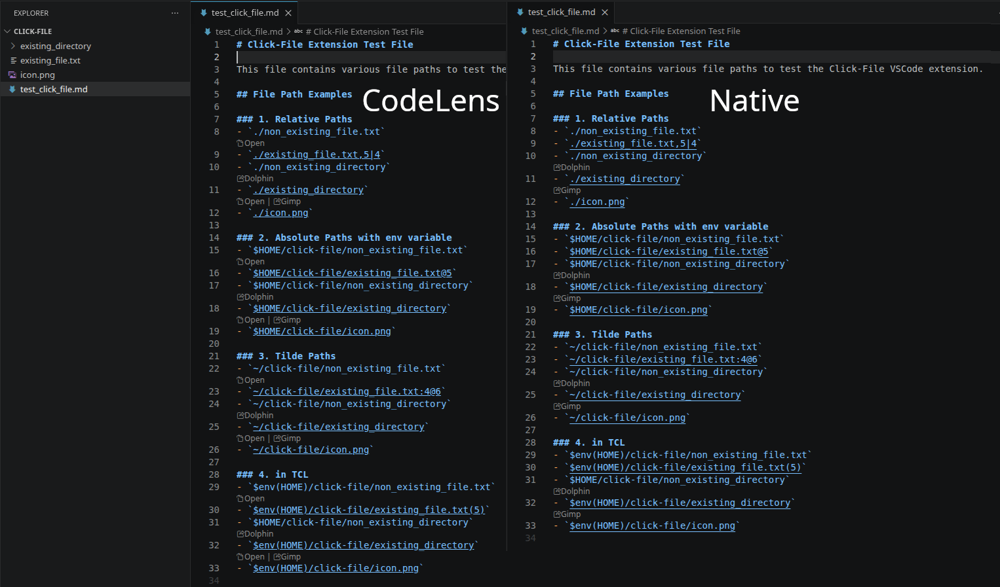

# Click-File

This extension highlights file paths in your code and makes them clickable. You can open files directly in VS Code or use an external tool.

## Features

This extension detects file and directory paths in your code, underlines them, and provides an **"Open"** button via CodeLens. It supports the following path formats:

- Absolute paths: `/path/to/file.txt` or `/path/to/directory`
- Relative paths: `./relative/path/file.txt`, `../parent/path/directory` or `./relative/path`
- Paths with environment variables: `$HOME/file.txt`, `~/file.txt`, `$HOME/directory`, or `~/directory`
- Paths with line numbers: `file.txt:42`, `file.txt@42`, `file.txt#42`, `file.txt,42`, or `file.txt|42`
- Paths with line and column numbers: `file.txt:42:1`, `file.txt@42@1`, `file.txt#42#1`, `file.txt,42,1`, or `file.txt|42|1`
- Directory paths: `/path/to/directory`, `./my-folder`, `../parent/dir`



### Core Functionality
- **File Path Detection**: Detects and underlines file paths in your code for visual feedback.
- **Two Interaction Styles**: Choose between:
  - **CodeLens Actions**: Shows an **"Open"** button above detected file paths
  - **Native Document Links**: Makes file paths directly clickable in the editor
- **Path Remapping**: Remap parts of directory paths to other locations (e.g., map `~` to `/home/user` or `/old/path` to `/new/path`).
- **Workspace Environment Variables**: Resolves environment variables from workspace `.env` files (`.vscode/.env` or `.env` in workspace root), in addition to system environment variables. Supports `__WORKSPACE_ROOT__` placeholder in `.env` values, which is automatically replaced with the workspace root directory.
- **Include Paths**: Add additional directories to search for files when resolving relative paths. This is particularly useful for C/C++ development where header files may be located in include directories (e.g., `#include "file.h"` where `file.h` is in a directory specified in `includePaths`).

The extension provides two different ways to interact with file paths, configurable via the `click-file.linkStyle` setting.

### Configuration
The extension provides several configuration options to customize its behavior:

- **`click-file.linkStyle`**: Choose how file/directory references should be displayed (CodeLens buttons or native document links)
- **`click-file.externalFiles`**: Configure external tools to open specific file types or patterns
- **`click-file.externalDirectories`**: Configure external tools to open directories
- **`click-file.remapDirectories`**: Remap directory paths to other locations
- **`click-file.includePaths`**: Add additional directories to search for files when resolving relative paths
- **`click-file.logLevel`**: Set the log level for debugging (none, error, warning, note, debug)

See the [Extension Settings](#extension-settings) section for more details.

## Extension Settings

This extension contributes the following settings:

### `click-file.linkStyle`
Choose how file references should be displayed:
```json
"click-file.linkStyle": "codelens"  // or "documentlink"
```
- `codelens`: Shows action buttons above file paths (default)
- `documentlink`: Makes file paths directly clickable in the editor

### `click-file.externalFiles`
Configure external tools to open files. Example:
```json
"click-file.externalFiles": [
  {
    "tool": "EOG",
    "command": "/usr/bin/eog %f",
    "types": [],
    "patterns": ["*.png"]
  }
]
```
- `tool`: Name of the tool (displayed in the context menu).
- `command`: Command to execute (use `%f` as a placeholder for the file path and `%n` for the line number).
- `types`: (Optional) File extensions this tool should be available for (e.g., `["log", "txt"]`).
- `patterns`: (Optional) File name patterns this tool should be available for (e.g., `["*.log", "error_*"]`).

### `click-file.externalDirectories`
Configure external tools to open directories. Example:
```json
"click-file.externalDirectories": [
  {
    "tool": "explorer",
    "command": "explorer %d",
    "patterns": ["docs", "src"]
  }
]
```
- `tool`: Name of the tool (displayed in the context menu).
- `command`: Command to execute (use `%d` as a placeholder for the directory path).
- `patterns`: (Optional) Directory name patterns this tool should be available for (e.g., `["docs", "src"]`).

### `click-file.remapDirectories`
Remap part of a directory path with another directory path. Example:
```json
"click-file.remapDirectories": {
  "/old/path": ["/new/path1", "/new/path2"],
  "~": ["/mnt/c/Users/username"]
}
```
- Keys: Directory paths to match (supports `~` for home directory and environment variables like `$HOME`).
- Values: Array of replacement directory paths.
- Environment variables are resolved from both system environment variables and workspace `.env` files (`.vscode/.env` or `.env` in workspace root).

### `click-file.includePaths`
Add additional directories to search for files when resolving relative paths. This is particularly useful for C/C++ development where header files may be located in include directories. Example:
```json
"click-file.includePaths": [
  "/usr/local/include",
  "/usr/include",
  "${workspaceFolder}/include",
  "~/.local/include"
]
```
- Each entry is a directory path where the extension will look for files.
- Supports `~` for home directory expansion.
- Supports environment variables (e.g., `$HOME`, `$WORKSPACE`).
- Supports workspace variables (e.g., `${workspaceFolder}` - note: use the actual workspace path or environment variables for best results).
- Environment variables are resolved from both system environment variables and workspace `.env` files (`.vscode/.env` or `.env` in workspace root).
